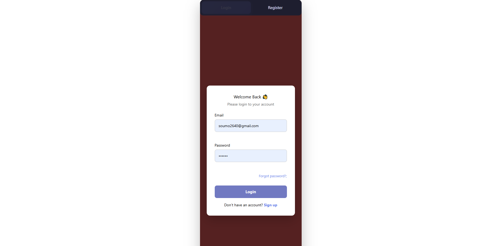
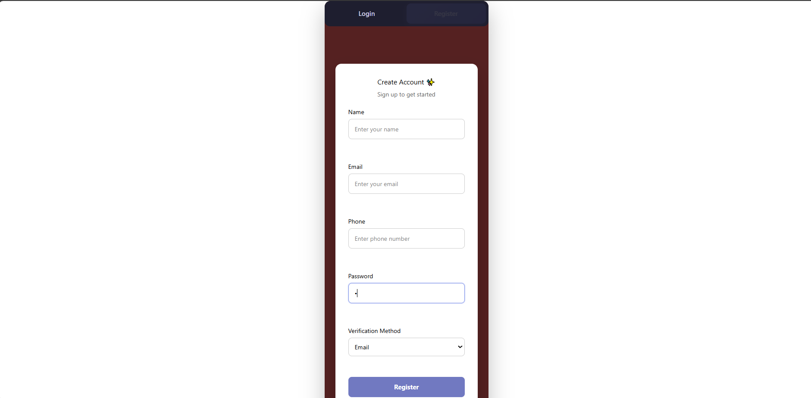
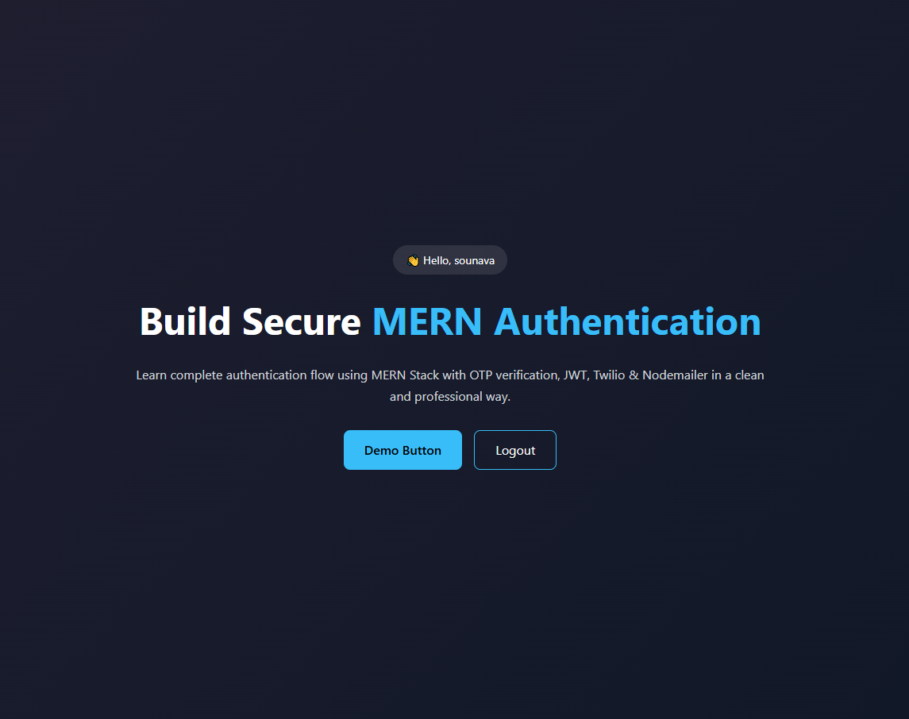
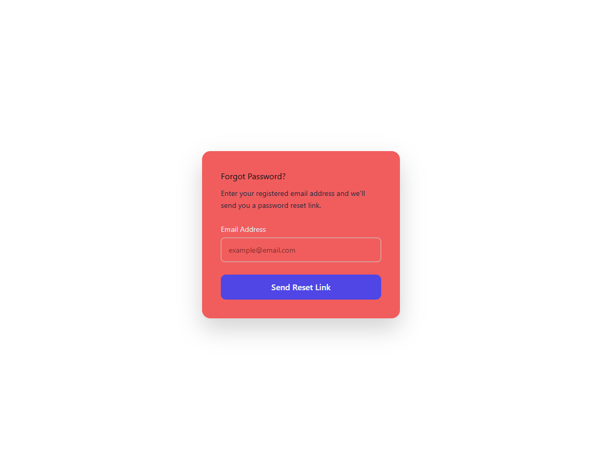
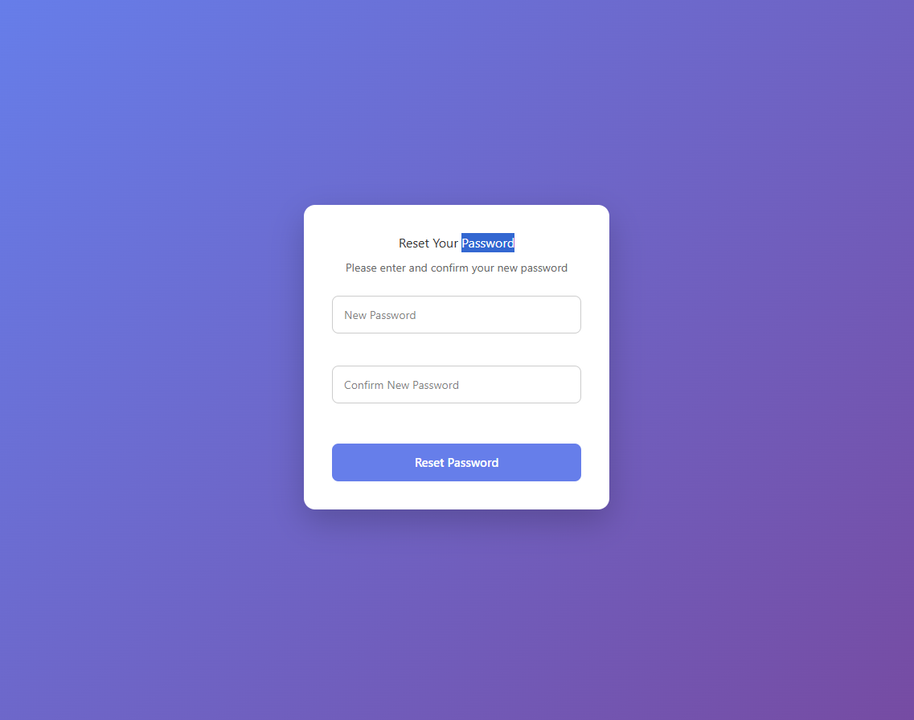

# MERN Authentication System

A secure **MERN Stack Authentication System** with **OTP verification**, **JWT authentication**, **Twilio SMS**, and **Nodemailer email** integration. Built with **React**, **Node.js/Express**, and **MongoDB**.  

This project demonstrates a professional authentication flow with login, registration, password reset, and OTP verification features.

---

## 🔹 Features

- **User Registration & Login**  
- **OTP Verification** (via email/phone)  
- **JWT Authentication** for secure sessions  
- **Forgot Password & Reset Password Flow**  
- **Protected Routes in React**  
- **Logout Functionality**  
- **Responsive UI**  

---


---

## 🔹 Technologies Used

- **Frontend:** React, React Router DOM, Vite, CSS  
- **Backend:** Node.js, Express.js, MongoDB, Mongoose  
- **Authentication:** JWT, OTP (Twilio, Nodemailer)  
- **Notifications:** react-toastify  
- **Others:** dotenv for environment variables  

---

## 🔹 Screenshots

### Login Page


### Register Page


### Home Page


### Forgot Password Page


### Reset Password Page


---

## 🔹 Installation

### 1. Clone the repository

```bash
git clone https://github.com/Sounava2000/MERN-Authentication.git
cd mern-auth-system
